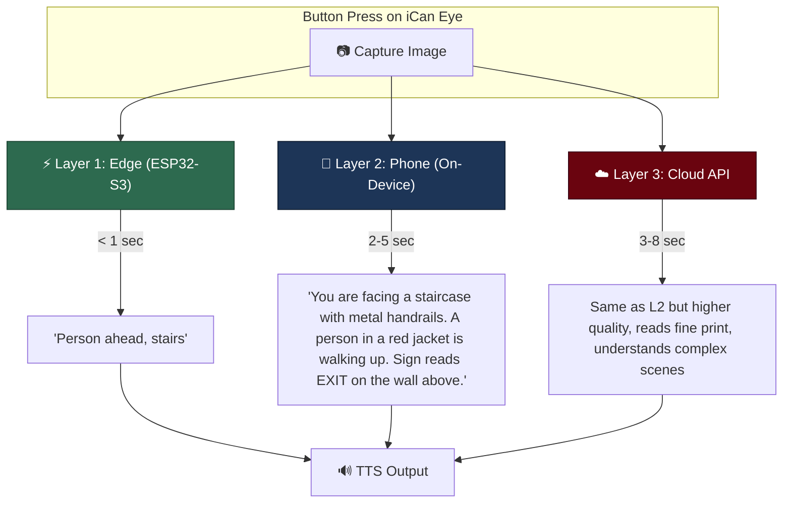
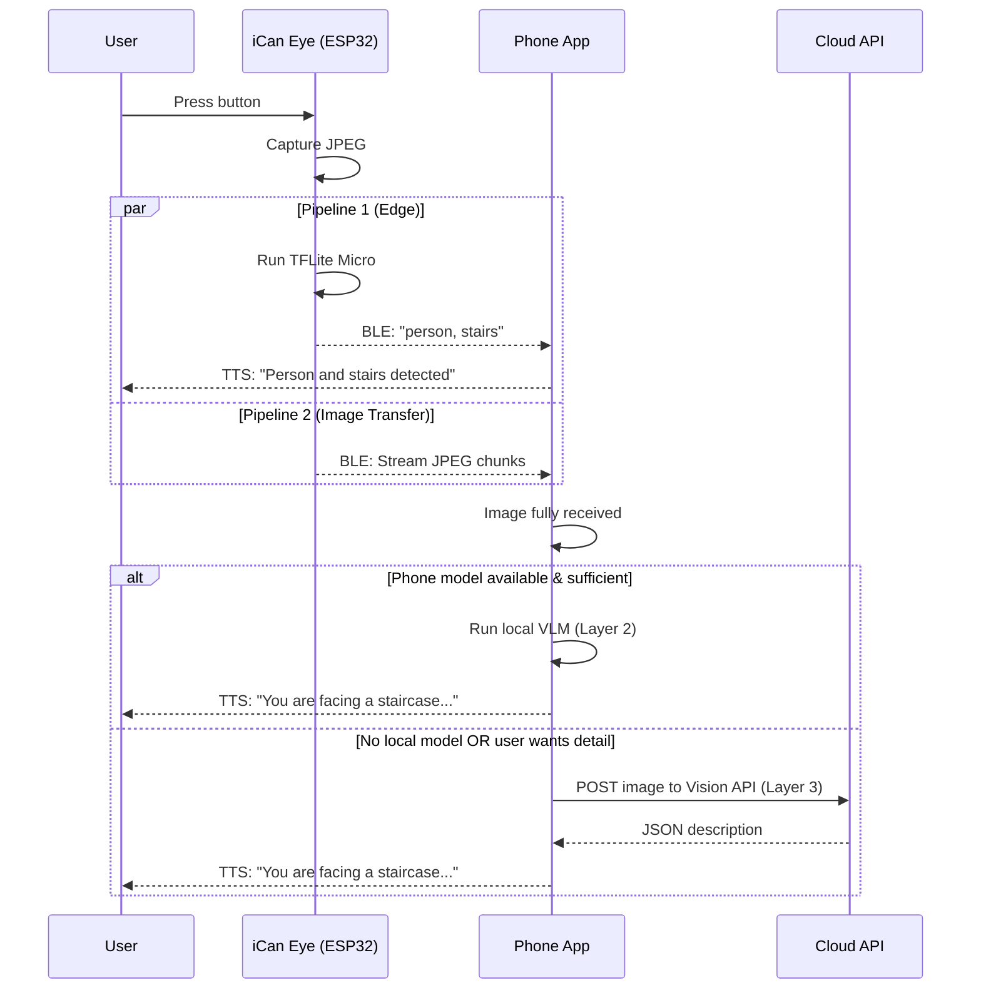

# iCan Eye — Three-Layer AI Architecture Plan

## Problem & Context

The iCan Eye is a wearable camera device (XIAO ESP32-S3 Sense) for visually impaired users. When the user presses a button, it captures an image and describes the scene in natural language via audio. The user wants a **three-layer, adaptable AI inference strategy** so the system works across different connectivity and hardware situations.

The current codebase has:
- **Firmware**: [main.cpp](file:///c:/Users/17733/ican/firmware/ican_eye/src/main.cpp) — dual-pipeline BLE (instant text placeholder + image stream)
- **App**: Flutter with BLE, TTS, STT services
- **ML Playground**: [ml_evaluation/](file:///c:/Users/17733/ican/ml_evaluation) — Ollama-based image description, TFLite MobileNet evaluation scripts
- **Protocol**: [ble_protocol.yaml](file:///c:/Users/17733/ican/protocol/ble_protocol.yaml) — single source of truth for BLE UUIDs and packet formats

> [!IMPORTANT]
> This document is an **architecture plan**, not a code implementation plan. No code changes are proposed — the goal is to agree on the right approach before building.

---

## The Three Layers

The three layers are ordered by **proximity to the user** and each serves a distinct purpose:



---

### Layer 1 — Edge AI (ESP32-S3 On-Device)

| Attribute | Detail |
|-----------|--------|
| **Where** | Runs directly on the XIAO ESP32-S3 Sense |
| **What it does** | Object classification / detection — outputs short labels like `"person"`, `"car"`, `"stairs"` |
| **Model type** | TFLite Micro (quantized INT8) — ~300KB-1MB |
| **Model candidates** | MobileNet V2 (classification), SSD MobileNet (detection), Person Detection (TF Micro example), or SenseCraft AI pre-built models |
| **Latency** | < 1 second |
| **When to use** | **Always** — this is the first thing that fires on every button press, regardless of phone connection |
| **Output** | Short text label sent via BLE GATT (`eye_instant_text_tx`) |
| **Limitation** | Cannot produce natural language scene descriptions. Limited vocabulary (typically 90 COCO classes or less) |

**Why this matters**: Even if the phone is disconnected or the cloud is down, the user gets *something* immediately. A blind user hearing "car" or "person, stairs" within one second has actionable safety information.

**Current state**: The [main.cpp](file:///c:/Users/17733/ican/firmware/ican_eye/src/main.cpp) Pipeline 1 has a placeholder (`"object detected"`) — the actual TFLite Micro inference needs to be integrated.

---

### Layer 2 — Phone-Local AI (On-Device VLM)

| Attribute | Detail |
|-----------|--------|
| **Where** | Runs on the user's smartphone (Android/iOS) inside the Flutter app |
| **What it does** | Full natural-language scene description from the captured image |
| **Model type** | Vision Language Model (VLM), quantized for mobile |
| **Model candidates** | moondream2 (~1.8B, via MLC LLM), MiniCPM-V, Phi-3-Vision (4-bit), Google ML Kit + Gemini Nano (Android), Apple VisionKit (iOS) |
| **Latency** | 2-5 seconds |
| **When to use** | **Primary inference path** — when phone is connected and has sufficient resources |
| **Output** | Rich description read via TTS (e.g., *"You are on a sidewalk. There is a crosswalk ahead. The sign reads WALK."*) |
| **Limitation** | Requires a modern phone (6GB+ RAM). Model quality varies. Some models may struggle with fine text or complex scenes |

**Why this matters**: This is the **core experience**. No internet required, no API costs, reasonable latency. The image is already being streamed to the phone via Pipeline 2 (BLE image stream), so this layer simply processes what arrives.

**Current state**: The [describe_images.py](file:///c:/Users/17733/ican/ml_evaluation/describe_images.py) script in `ml_evaluation/` uses Ollama with `llama3.2-vision` / `llava` / `moondream` locally on a PC — this validates the concept but runs on desktop, not on-device mobile. The next step is porting this to run inside the Flutter app using a mobile-optimized runtime.

---

### Layer 3 — Cloud API (Fallback / Premium)

| Attribute | Detail |
|-----------|--------|
| **Where** | Remote server via HTTPS from the phone app |
| **What it does** | Highest-quality natural-language scene description |
| **Model candidates** | **Google Gemini (Vertex AI)** — Primary choice due to Developer Benefits. Alternates: OpenAI GPT-4o, Claude Vision |
| **Latency** | 3-8 seconds (network dependent) |
| **When to use** | (a) User explicitly opts in for "detailed mode", (b) Phone model is unavailable or quality is insufficient, (c) Specific tasks like reading fine print, documents, medication labels |
| **Output** | Rich description read via TTS, potentially higher quality than Layer 2 |
| **Limitation** | Requires internet, has API cost (though subsidized by benefits), introduces privacy considerations (sending images to a third party) |

**Why this matters**: Cloud models are significantly more capable today—they read handwriting, medication labels, restaurant menus, and understand nuanced spatial relationships better than current on-device VLMs. For a visually impaired user, the ability to ask "what does this paper say?" and get an accurate reading is transformative.

**Strategic Advantage (Google Developer Benefits)**: 
The user currently has **$45 monthly in Gen AI & Cloud credits** via the Google Developer Program. This makes Google's **Vertex AI (Gemini Pro Vision/Gemini 1.5 Pro)** the absolute best choice for Layer 3. 
- The $45/month credit is more than enough to cover thousands of high-quality image descriptions per month during development and early beta testing.
- The benefits also include "Consultation with Google Cloud experts" (1-to-1 advice), which can be leveraged to optimize the precise prompt engineering and architecture for the Gemini Vision API calls.

**Current state**: Not implemented. The [ml-model-list.md](file:///c:/Users/17733/ican/ml_evaluation/docs/ml-model-list.md) doc mentions "Cloud Based Vision AI APIs" as top tier but has no details yet.

---

## How the Three Layers Work Together

This is **not** "pick one" — the layers operate in a **cascading, complementary** flow:



### Layer Selection Logic (in the App)

```
1. Layer 1 ALWAYS fires (on ESP32, instant)
2. Image arrives on phone via BLE →
   a. If Layer 2 model is loaded and phone has resources → run Layer 2
   b. If Layer 2 fails / times out / user setting is "cloud" → fall back to Layer 3
   c. If no internet for Layer 3 → use Layer 1 result only
```

The user should be able to configure their preference in app settings:
- **"Offline Only"** → Layers 1 + 2 only (no cloud)
- **"Auto"** (default) → Layer 1 + 2, with Layer 3 fallback
- **"Detailed"** → Layer 1 + Layer 3 always (skip Layer 2 for better quality)

---

## Practical Considerations & Recommendations

### 1. Does TFLite on the ESP32 make sense for *image description*?

**No, not for description.** TFLite Micro on the ESP32-S3 can do **classification** (what is the main object?) and **detection** (where are objects?), but it **cannot** generate natural language descriptions. That requires a Vision Language Model, which is far too large for the ESP32.

> [!WARNING]
> Layer 1 should be framed as **"instant safety labels"**, not "image description." It outputs class names, not sentences. The sentence-level description comes from Layer 2 or 3.

### 2. Recommended models per layer

| Layer | Top Recommendation | Backup | Notes |
|-------|-------------------|--------|-------|
| **L1 (ESP32)** | SSD MobileNet V1 (INT8, ~4MB) or a custom person/obstacle detector | MobileNet V2 classifier (300KB) | Consider SenseCraft AI pre-built models that run on ESP32-S3 |
| **L2 (Phone)** | moondream2 via MLC LLM | MiniCPM-V or platform-native (ML Kit + Gemini Nano on Android, VisionKit on iOS) | Start with platform-native APIs first — they're free, optimized, and easy to integrate in Flutter |
| **L3 (Cloud)** | **Google Gemini (Vertex AI)** | OpenAI GPT-4o, or self-hosted Ollama on a VPS | **Mandatory first choice:** Utilize the $45/month Google Developer Gen AI credits. Gemini 1.5 Flash/Pro is highly cost-effective and integrates perfectly with Flutter via the `google_generative_ai` package.

### 3. Self-hosted cloud option (Ollama on a VPS)

Your [describe_images.py](file:///c:/Users/17733/ican/ml_evaluation/describe_images.py) already talks to an Ollama REST API. You could deploy this same setup on a cheap VPS (e.g., $20-40/month GPU instance) and have your app point to it instead of a commercial API. This gives you:
- **No per-request API costs** (after server cost)
- **Full control** over the model and prompt
- **Privacy** — images stay on your server
- Same REST API as your existing evaluation code

### 4. Prompt engineering (shared across Layer 2 & 3)

Your `SYSTEM_PROMPT` in [describe_images.py](file:///c:/Users/17733/ican/ml_evaluation/describe_images.py) is excellent and should be reused across all layers. The priority-ordered description format (text/signs → people → safety → location → objects) is ideal for accessibility.

### 5. Battery and power

- **Layer 1** is lightweight — no significant extra drain beyond the camera capture
- **BLE image transfer** for Layer 2/3 is the main power concern — the 1200mAh battery is small. Consider allowing the user to choose image quality (lower JPEG quality = smaller file = faster BLE transfer = less power)
- **Layer 2 on the phone** uses phone battery, not the Eye's battery — this is a major advantage

---

## Summary: Does the Three-Layer Approach Make Sense?

**Yes, absolutely.** Here's why it's the right architecture for this use case:

| Concern | How the 3-layer approach addresses it |
|---------|--------------------------------------|
| **No phone nearby** | Layer 1 still works standalone on the ESP32 |
| **No internet** | Layers 1 + 2 work fully offline |
| **Needs best quality** | Layer 3 provides state-of-the-art descriptions |
| **Cost** | Layer 1 & 2 are free; Layer 3 can be optional or self-hosted |
| **Latency** | Layer 1 gives instant feedback; Layer 2/3 follow with detail |
| **Adaptability** | New models can be swapped into any layer without changing the others |

The key insight is that **each layer has a different job**: Layer 1 is for instant safety, Layer 2 is for the daily-use rich description, and Layer 3 is for maximum quality when the user needs it.

---

## What's NOT in This Plan

This plan covers the AI inference architecture only. The following are already in progress or covered by the existing [development_plan.md](file:///c:/Users/17733/ican/development_plan.md):
- BLE image transfer protocol (already implemented in [main.cpp](file:///c:/Users/17733/ican/firmware/ican_eye/src/main.cpp) and [ble_protocol.yaml](file:///c:/Users/17733/ican/protocol/ble_protocol.yaml))
- TTS integration (already exists in [lib/services/tts_service.dart](file:///c:/Users/17733/ican/lib/services/tts_service.dart))
- Navigation, haptics, obstacle detection (iCan Cane scope)
